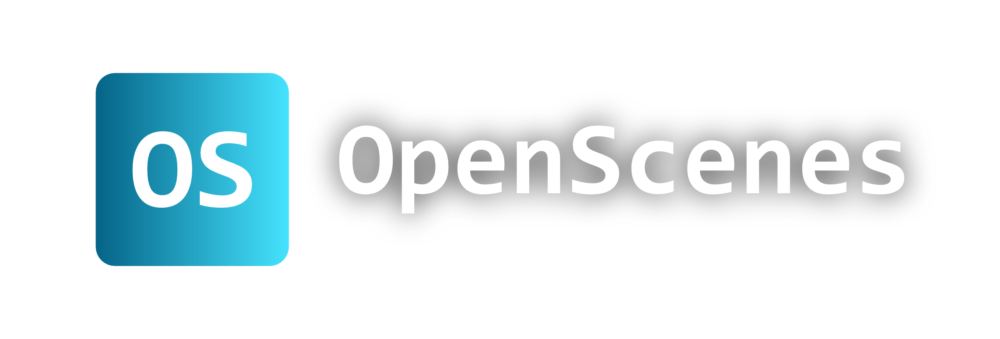

<div align="center">

<!-- Logo placeholder -->
<!--  -->

<p align="center">
  
</p>

[](https://github.com/WassBe/openscenes)


Local, self-hosted character roleplay chatbot. Dispatches each chat to a backend **you** choose — your own **OpenScenes Agent** (a standalone llama-cpp server, BYOM) or a cloud provider like **OpenRouter**, **Together AI**, **Groq**, or **Mistral** (BYOK) — chosen per chat. Your providers, your models, your data: no platform lock-in, no ads, no middleman.

</div>

---

## Table of contents

- [What it does](#what-it-does)

**User manual** — install OpenScenes and start chatting, no coding required:

- [Requirements](#requirements)
- [Setup](#setup)
- [First run](#first-run)
- [Configuring providers (BYOK)](#configuring-providers-byok)
- [Creating a character](#creating-a-character)
- [Chatting](#chatting)
- [Managing users and personas](#managing-users-and-personas)
- [Configuration](#configuration)

**Technical documentation** — architecture, API, and development, for self-hosters and contributors:

- [Project structure](#project-structure)
- [API reference](#api-reference)
- [Running in development](#running-in-development)
- [Contributing](#contributing)

---

## What it does

OpenScenes lets you create characters with a persona, a scene context, and an opening line, then chat with them through a browser. Conversation history, characters, personas, chat styles, per-user LLM labels, and connection credentials all live as plain JSON / markdown files in `database/` on your disk.

Inference itself lives **out of process**. The main app is provider-agnostic — it speaks HTTP to either:

- **OpenScenes Agent** — a sibling project (`../agent/`) that wraps `llama-cpp-python` and serves local GGUF weights. Runs anywhere, talks back over a tiny HTTP contract. Use it for fully-local, offline inference on your own hardware.
- **A cloud provider** — OpenRouter, Together AI, Groq, or Mistral, each an OpenAI-compatible endpoint reached with your own API key. Providers are defined in a registry, so the list is easy to extend.

You pick per chat. Credentials are per-user (BYOK) and never leave your server except in outbound calls.

> The `database/` tree contains your chats, personas, API keys, and per-user LLM lists. The repo's `.gitignore` excludes it — keep it that way.

---

# User manual

> Everything a user needs to get OpenScenes running and start chatting. No coding — just two commands and a provider key.

### Requirements

- Python 3.10+
- Node.js and npm (any recent LTS)
- Either a cloud provider API key (OpenRouter, Together AI, Groq, or Mistral), or the OpenScenes Agent installed and running (see [OpenScenes Agent](https://github.com/WassBe/openscenes-agent)).

### Setup

```bash
cd source
python setup.py
```

That creates a virtualenv at `core/env/`, installs the backend requirements (just Flask + flask-cors + requests now — no llama-cpp here), and builds the React client.

If you want local inference, also install the agent — its setup is documented in https://github.com/WassBe/openscenes-agent/blob/main/README.md.

### First run

```bash
python start.py
```

Flask starts on `http://localhost:8080` and serves both the API and the built client from that one address. Open it in your browser. Press `Ctrl+C` to stop. No separate Node process runs at this point — the client was already built during setup.

### Configuring providers (BYOK)

Before sending your first message, link at least one provider in **Settings → Connections**:

- **OpenScenes Agent** — paste the agent's URL (e.g. `http://127.0.0.1:8090`). If the agent has an `API_KEY` in its `config.ini`, paste that too; leave blank otherwise.
- **A cloud provider** (OpenRouter, Together AI, Groq, Mistral) — paste your API key for that provider. Each section appears automatically for every provider in the registry.

API keys are masked in every response (`…last4` preview plus a `has_api_key` flag) and only travel in the outbound call to the provider.

Then register at least one **LLM** in **Settings → LLMs**. Each entry has a **Name** (a free display label, e.g. `Claude 3.5 (OpenRouter)`), a **Model** (the identifier sent to the provider), and a **Provider**:

- **Provider: OpenScenes Agent** — the model is the LLM name registered with your agent (e.g. `Meta-Llama-3.1-8B-Instruct-Q4_K_M`).
- **Provider: a cloud provider** — the model is that provider's model id (e.g. `anthropic/claude-3.5-sonnet` on OpenRouter).

Because the display name is separate from the model id, you can register the **same model under several providers** and tell them apart in the chat picker.

### Creating a character

1. Go to **Manage → Chat styles** and create a style: name, description, and a markdown rules file that tells the model how to behave. Each style has a **duplicate** button so you can branch variants. Chat styles are pure rules wrappers and don't reference any LLM — the LLM is picked per chat.
2. Go to **Manage → Characters** and create a character:
   - **Name** — how the character is referred to everywhere.
   - **Description** — the short blurb shown in lists.
   - **Persona** — a markdown document describing who the character is.
   - **Context** — where the scene takes place.
   - **Opening message** — the first line the character says. Optional.
   - **Picture** — an avatar. Optional; PNG/JPG/GIF/WEBP.

Persona, context, and opening support `{character}` and `{user}` placeholders that get replaced with real names at chat time.

### Chatting

Go to **Home** or **Search**, pick a character, click **Start chat**. The chat opens with the character's opening line if one was set.

In the chat header, pick a **chat style** and an **LLM** before sending your first message. Both choices persist per chat — you can change them at any time without losing history.

Per-message actions:
- **Edit** — rewrite the last message of a role without regenerating anything.
- **Retry** — ask the model for another response to the same prompt. Saved as a variant; use `‹ ›` to flip between them.
- **Continue** — send with an empty composer to have the model keep writing.
- **Rewind** — truncate the history back to a chosen message.
- **Delete** — remove a single message.

### Managing users and personas

Click your name (or "Guest") in the navbar to open the session panel. Create users, rename them, upload profile pictures, and manage personas.

A persona is the role you play in the scene — name, description, and a markdown document the model receives alongside the character's prompt. If you have multiple personas, a selector appears in the chat header.

Each user has their **own** LLM labels and Connections credentials — switching users switches both.

### Configuration

`source/config.ini` controls where the database lives and what addresses the backend and client listen on:

```ini
DATABASE=./database
CORE_ADDRESS=localhost
CORE_PORT=8080
CLIENT_ADDRESS=localhost
CLIENT_PORT=5173
```

Per CONVENTION.md §Sensitive data, no API keys live here — those are stored per-user inside the gitignored `database/` tree.

---

# Technical documentation

> How OpenScenes is built, its HTTP API, and how to run it in development. For self-hosters and contributors — skip this if you just want to chat.

## Project structure

```
source/
├── config.ini          — addresses, ports, database path
├── setup.py            — installer (venv + deps + client build)
├── start.py            — launcher (runs the backend, which also serves the built client)
├── api-routes.html     — rendered API reference
├── core/               — Flask backend (no local inference)
├── client/             — React 19 + Vite frontend
└── database/           — filesystem-backed storage
    ├── styles/         — chat-style presets (index + one .md per style)
    ├── characters/     — character data (index + one dir per character)
    └── users/          — user data
        └── <dir>/      — user.json, chats.json, settings.json, llms.json, personas/
```

### Backend — `core/`

| File | Role |
|------|------|
| `main.py` | All Flask routes — chats, users, personas, characters, chat styles, per-user LLMs and settings |
| `girlfriend.py` | Prompt assembly, HTTP dispatch to the Agent or OpenRouter, chat history I/O |
| `config.py` | Reads `config.ini` and exports the resolved constants |
| `requirements.txt` | `flask`, `flask-cors`, `requests` |

Every data collection is stored as an index file shaped `{"next_id": int, "items": [...]}`. IDs are monotonically increasing and never reused.

### Frontend — `client/`

React 19 + Vite + react-router-dom 7. Built output goes to `client/dist/` and is served by Flask (the backend) when launched through `start.py` — no separate Node process runs at runtime.

```
client/src/
├── main.jsx              — entry point, providers, route tree
├── App.jsx               — shell (navbar, sidebar, page slot)
├── context/
│   ├── AppContext.jsx    — global state: users, characters, chat styles, chats
│   └── ThemeContext.jsx  — light/dark theme, persisted to localStorage
├── components/
│   ├── Avatar.jsx
│   ├── Icon.jsx
│   ├── Navbar.jsx
│   ├── Sidebar.jsx
│   └── SessionModal.jsx
└── pages/
    ├── Home.jsx
    ├── Search.jsx
    ├── Character.jsx
    ├── Manage.jsx         — shared admin (Characters + Chat styles)
    ├── Settings.jsx       — per-user (LLMs + Connections)
    ├── chat/Chat.jsx      — chat room
    ├── manage/
    │   ├── CharactersTab.jsx
    │   └── StylesTab.jsx
    └── settings/
        ├── LlmsTab.jsx
        └── ConnectionsTab.jsx
```

### Database — `database/`

All storage is plain files — no database engine. Each resource lives in a randomly-named directory to avoid collisions, with an index JSON at the collection root:

- `users/users.json` + `users/<dir>/` — each user dir holds `user.json`, `chats.json`, `settings.json` (Connections: OpenRouter key + Agent address/key, gitignored), `llms.json` (this user's LLM labels), and `personas/`.
- `characters/characters.json` + `characters/<dir>/` — each character dir holds `character.json`, `persona.md`, `context.md`, `opening.txt`, and optionally a picture.
- `styles/styles.json` + one `.md` per chat style.

---

## API reference

All endpoints are under `/api`. Every response is JSON. Errors come back as `{"error": "..."}`.

For the full rendered reference open `source/api-routes.html` in a browser.

### Chats

| Method | Path | Description |
|--------|------|-------------|
| GET | `/api/chats/<user_id>` | List all chats for a user |
| POST | `/api/chats/<user_id>/start` | Start or return a chat for a character |
| GET | `/api/chats/<user_id>/<chat_id>` | Get paginated history (`?before=<id>&limit=<n>`) |
| PUT | `/api/chats/<user_id>/<chat_id>` | Replace the full history |
| DELETE | `/api/chats/<user_id>/<chat_id>` | Delete a chat |
| PUT | `/api/chats/<user_id>/<chat_id>/style` | Set the chat style |
| PUT | `/api/chats/<user_id>/<chat_id>/llm` | Set the LLM |
| POST | `/api/chats/<user_id>/<chat_id>/rewind/<message_id>` | Truncate at a message |
| PUT | `/api/chats/<user_id>/<chat_id>/messages/<message_id>` | Edit a message |
| DELETE | `/api/chats/<user_id>/<chat_id>/messages/<message_id>` | Delete a message |

### Chat send

| Method | Path | Description |
|--------|------|-------------|
| POST | `/api/chat/send` | Generate a reply and append it to history |

Body fields: `user_id`, `chat_id`, `character_id`, `persona_id`, `style_id`, `message` (string), `new_attempt` (bool), `continue_mode` (bool). The chat's `llm_id` is read server-side.

### Users

| Method | Path | Description |
|--------|------|-------------|
| GET | `/api/users` | List all users |
| POST | `/api/users` | Create a user (`username`) |
| PUT | `/api/users/<id>` | Rename a user |
| DELETE | `/api/users/<id>` | Delete a user and all their data |
| GET / PUT / DELETE | `/api/users/<id>/picture` | Profile picture |
| GET / PUT | `/api/users/<id>/settings` | Connections (per-provider API keys, Agent address + optional key). Keys masked in responses. |
| GET | `/api/users/<id>/llms` | List the user's LLM entries (`{id, name, model, provider}`) |
| POST | `/api/users/<id>/llms` | Create (`name`, `model`, `provider` ∈ {`agent`, `openrouter`, `together`, `groq`, `mistral`}) |
| GET / PUT / DELETE | `/api/users/<id>/llms/<llm_id>` | Get / edit (`name?`, `model?`) / delete one entry |

### Providers

| Method | Path | Description |
|--------|------|-------------|
| GET | `/api/providers` | List supported providers (registry + agent) for the UI |

### Personas

| Method | Path | Description |
|--------|------|-------------|
| GET | `/api/users/<user_id>/personas` | List personas |
| POST | `/api/users/<user_id>/personas` | Create (`name`, `description`, `content`) |
| GET / PUT / DELETE | `/api/users/<user_id>/personas/<id>` | Get / edit / delete |

### Characters

| Method | Path | Description |
|--------|------|-------------|
| GET | `/api/characters` | List all characters |
| GET | `/api/characters/<id>` | Get character + persona / context / opening |
| POST | `/api/characters` | Create |
| PUT | `/api/characters/<id>` | Edit |
| DELETE | `/api/characters/<id>` | Delete (cascades to every chat referencing it) |
| GET / PUT / DELETE | `/api/characters/<id>/picture` | Picture |

### Chat styles

| Method | Path | Description |
|--------|------|-------------|
| GET | `/api/styles` | List all chat styles |
| GET | `/api/styles/<id>` | Get style + rules markdown |
| POST | `/api/styles` | Create (`name`, `description`, `rules`) |
| PUT | `/api/styles/<id>` | Edit |
| POST | `/api/styles/<id>/duplicate` | Clone under a unique `<name> (copy)` |
| DELETE | `/api/styles/<id>` | Delete |

---

## Contributing

Contributions are welcome — bug fixes, new features, improvements to the docs. Please read [CONTRIBUTING.md](CONTRIBUTING.md) before opening a pull request.

---

## Running in development

**Backend** — Flask directly with file watching:

```bash
cd source/core
pip install -r requirements.txt
CHATBOT_DEBUG=1 python main.py
```

**Frontend** — Vite dev server with HMR, proxies `/api` to the Flask backend:

```bash
cd source/client
npm install
npm run dev
```

The dev server reads the target backend URL from `../config.ini` via `vite.config.js`. Both servers must be running.

**Agent** (if you want local inference) — see [`../agent/README.md`](../agent/README.md) for its own setup, its wire contract, and the move-test that proves it's relocatable.
